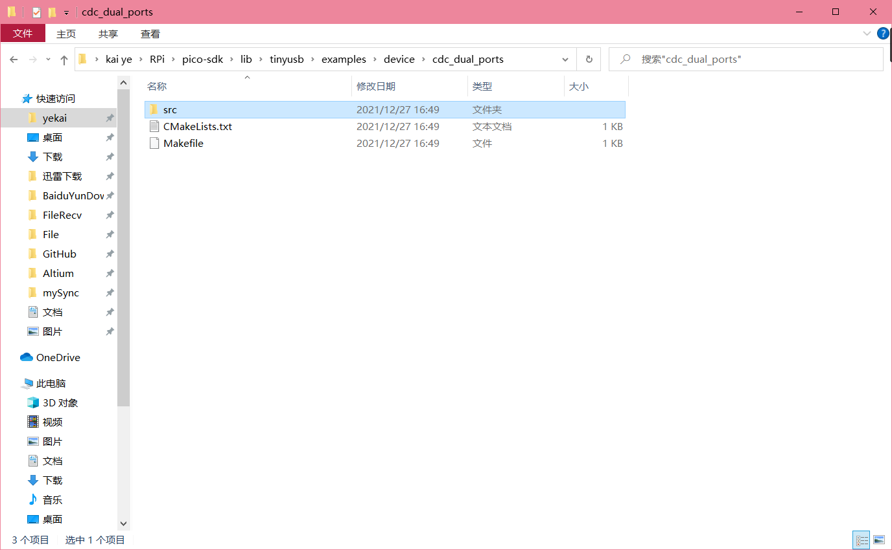
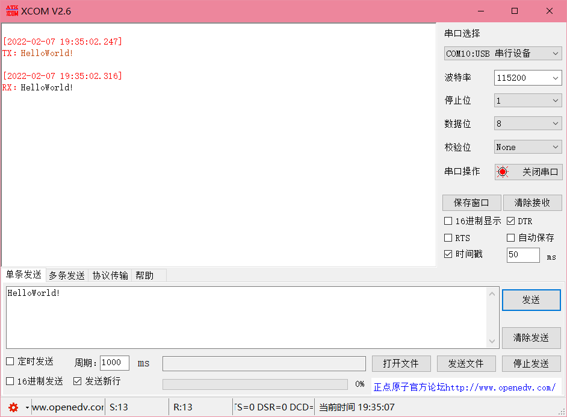
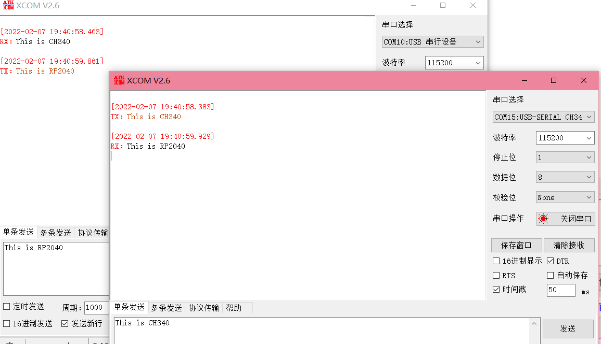
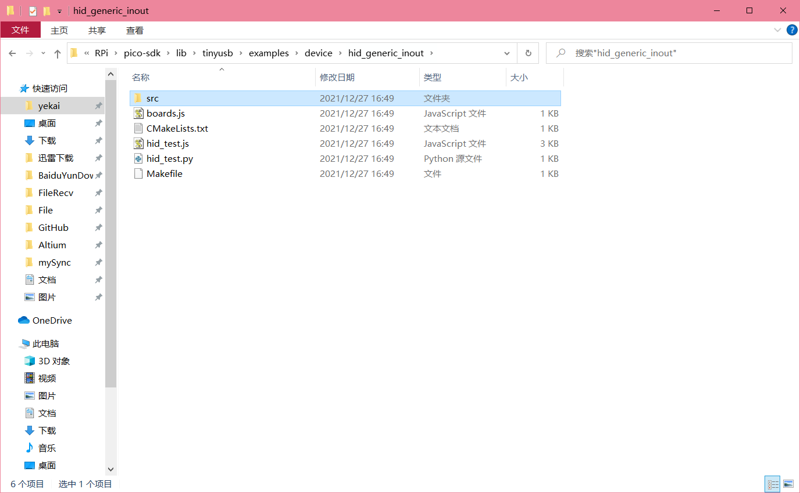
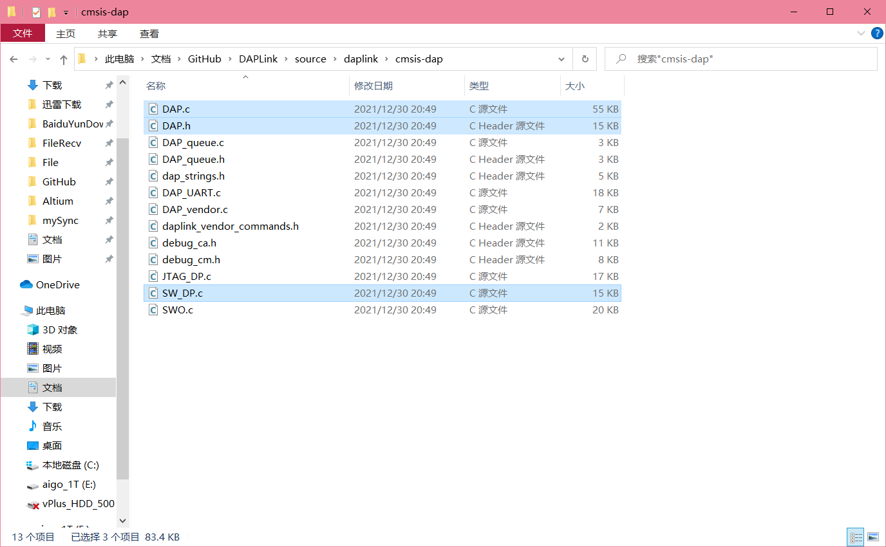
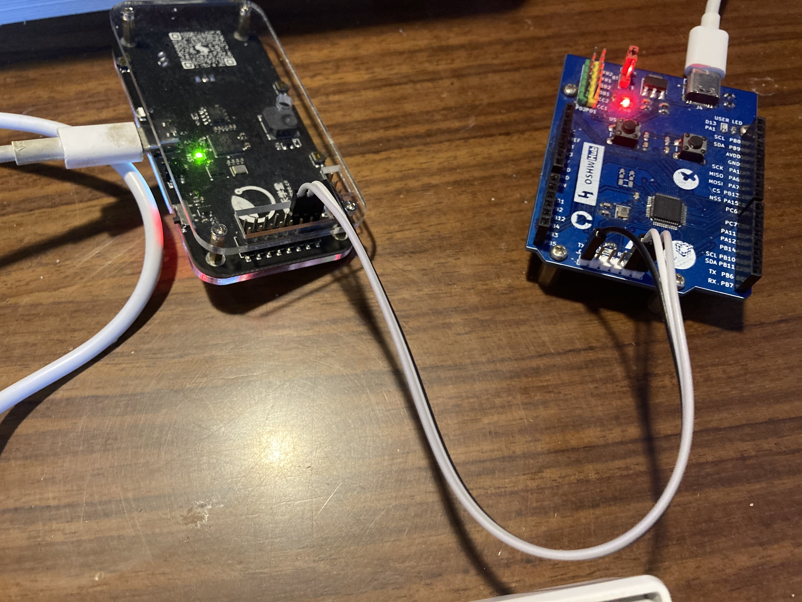
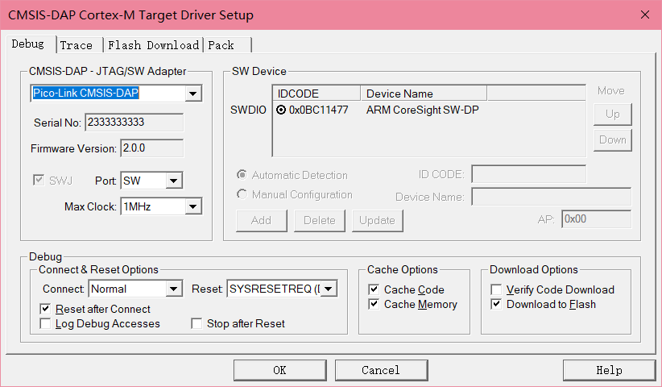
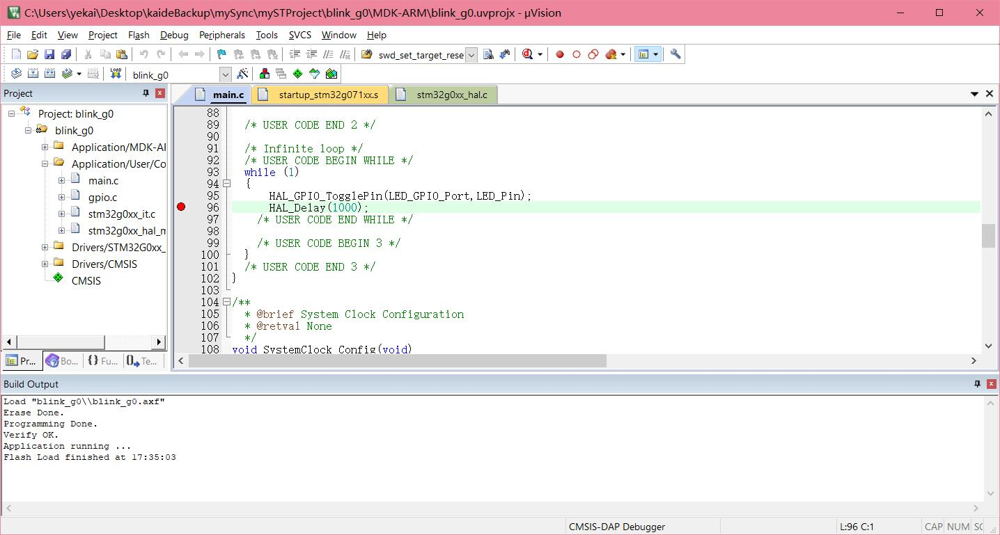
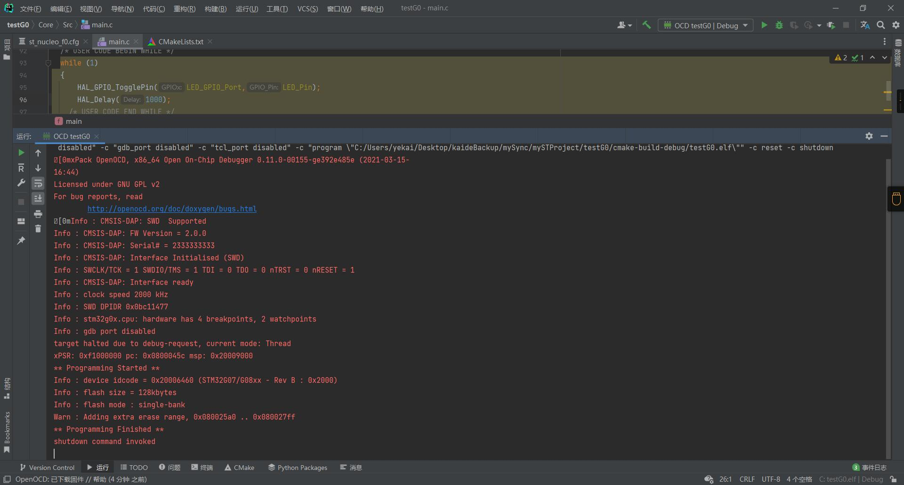
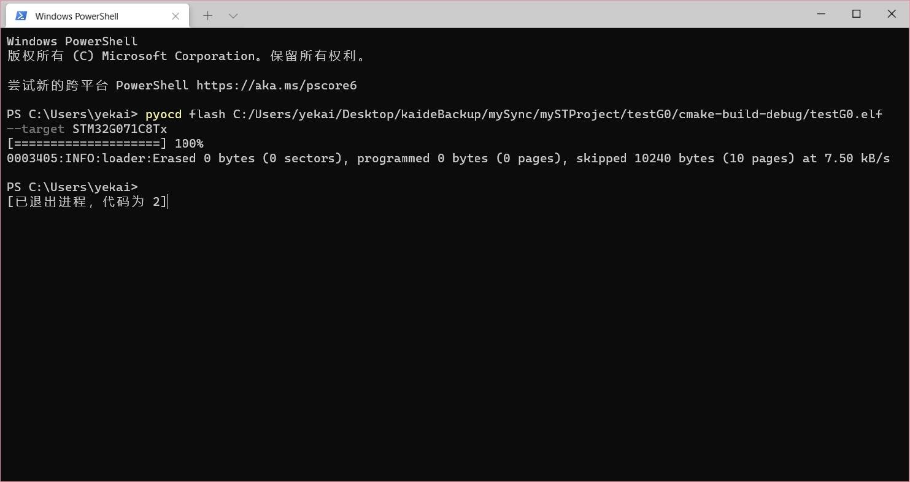

# 硬禾学堂2022年寒假在家一起练项目

## 任务需求及分析

我选择的是任务四：制作一个调试器

树莓派团队提供了一个PicoProbe项目用于调试，同时提供了他们修改过的OpenOCD。由于PicoProbe的兼容性有限，仅支持他们修改过的OpenOCD，对于Keil、pyOCD以及OpenOCD原项目等的支持不佳，我这边选择了移植DAPLink，原仓库地址[ARMmbed/DAPLink (github.com)](https://github.com/ARMmbed/DAPLink)。当然也可以使用[CMSIS_5/CMSIS/DAP/Firmware at develop · ARM-software/CMSIS_5 (github.com)](https://github.com/ARM-software/CMSIS_5/tree/develop/CMSIS/DAP/Firmware)这个仓库的源码，这个似乎更为简单。两个都是ARM提供的固件，ARMmbed的似乎实现了一个环形池和WEBUSB等好多内容，虽然我本次移植并没使用。

ARM团队去年1月还在PicoProbe项目的[issue](https://github.com/raspberrypi/picoprobe/issues/2)中提到了要使DAPLink支持RP2040，似乎暂时还咕咕咕着。

## 练手项目：USB-CDC

选择USB-CDC作为练手一方面是因为它不是一个调试器的必备选项，但是常见的调试器大多在版本迭代中加上了这个功能；另一方面是它可以让我们对tinyUSB有个初步的了解。例程如下，去掉第二个串口即可：



主要函数如下：

```c++
// USB->LINK回调
void tud_cdc_rx_cb(uint8_t itf) {
    char buf[CFG_TUD_CDC_RX_BUFSIZE] = {0};
    tud_cdc_read(buf, CFG_TUD_CDC_RX_BUFSIZE);
    uart_puts(PICO_LINK_UART_ID, buf);
}

// MCU->LINK回调
void on_uart_rx() {
    while (uart_is_readable(PICO_LINK_UART_ID)) {
        uint8_t ch = uart_getc(PICO_LINK_UART_ID);
        tud_cdc_write_char(ch);
    }
    tud_cdc_write_flush();
}

void VCOM_Init() {
    cdc_line_coding_t uart_config;
    tud_cdc_get_line_coding(&uart_config);
    uart_init(PICO_LINK_UART_ID, uart_config.bit_rate);
    gpio_set_function(PICO_LINK_UART_RX, GPIO_FUNC_UART);
    gpio_set_function(PICO_LINK_UART_TX, GPIO_FUNC_UART);
    irq_set_exclusive_handler(PICO_LINK_UART_IRQ, on_uart_rx);
    irq_set_enabled(PICO_LINK_UART_IRQ, true);
    uart_set_irq_enables(PICO_LINK_UART_ID, true, false);
}

void VCOM_SendString(char *str) {
    while (*str) {
        tud_cdc_write_char(*str++);
    }
    tud_cdc_write_char('\r');
    tud_cdc_write_char('\n');
    tud_cdc_write_flush();
}

// 检测到上位机串口助手开启串口回调
void tud_cdc_line_state_cb(uint8_t itf, bool dtr, bool rts) {
    VCOM_Init();
}

```

CDC在Windows10上免驱，打开设备管理器即可看到串口设备


回环测试：



和CH340收发测试：



## 移植DAPLink

注：在此仅实现了基于HID传输的DAPLink，暂未实现基于Bulk传输的DAPLink。

### USB配置

这一步可以参考TinyUSB的例程：



在tinyUSB的tusb_config.h文件中使能和添加这些宏：

```c++
#define CFG_TUD_HID               1
#define CFG_TUD_HID_EP_BUFSIZE    64
```

在usb_descriptors.h文件中参照例程修改

```c++
//--------------------------------------------------------------------+
// Configuration Descriptor
//--------------------------------------------------------------------+

enum {
    ITF_NUM_HID,
    ITF_NUM_CDC_COM,
    ITF_NUM_CDC_DATA,
    ITF_NUM_TOTAL
};

#define  CONFIG_TOTAL_LEN  (TUD_CONFIG_DESC_LEN + TUD_HID_INOUT_DESC_LEN + TUD_CDC_DESC_LEN)

#define EPNUM_HID       0x01
#define EPNUM_CDC_NOTIF 0x83
#define EPNUM_CDC_OUT   0x02
#define EPNUM_CDC_IN    0x82

uint8_t const desc_configuration[] = {
        // Config number, interface count, string index, total length, attribute, power in mA
        TUD_CONFIG_DESCRIPTOR(
                1,
                ITF_NUM_TOTAL,
                0,
                CONFIG_TOTAL_LEN,
                TUSB_DESC_CONFIG_ATT_REMOTE_WAKEUP,
                100
        ),

        // Interface number, string index, protocol, report descriptor len, EP In address, size & polling interval
        TUD_HID_INOUT_DESCRIPTOR(
                ITF_NUM_HID,
                0,
                HID_ITF_PROTOCOL_NONE,
                sizeof(desc_hid_report),
                EPNUM_HID,
                0x80 | EPNUM_HID,
                CFG_TUD_HID_EP_BUFSIZE,
                1
        ),

        TUD_CDC_DESCRIPTOR(
                ITF_NUM_CDC_COM,
                0,
                EPNUM_CDC_NOTIF,
                64,
                EPNUM_CDC_OUT,
                EPNUM_CDC_IN,
                64
        )
};
```

### 文件复制

dap中负责处理usb发来的数据并控制io口输出的文件主要就是以下几个：



DAP主要处理下发的命令，SW_DP和JTAG_DP主要将命令发送出去，DAP_config.h（在生成的各工程下）主要是DAP的配置和IO口的控制。

### DAP配置

修改DAP_config.h里面的一些函数和宏定义，基本就是把接口适配一下。接口适配时更推荐使用接近底层的寄存器或是直接能就地解析的inline函数写法来提升效率。本次移植中有几个适配RP2040的点：RESET原本设计为开漏输出，由于RP2040似乎没有开漏输出，在这里需稍加修改。DAP原本的原理图将SWDIO的输入和输出分为了两个IO，用100R进行了相连。为了适配GameKit，将其并为了一个IO。

代码较多，在此不贴出来了。

### USB任务接口配置

USB在接收到hid数据后会进入`tud_hid_set_report_cb`函数，具体可参考hid例程。在这里不同的项目有着不同的处理方式，ARMmbed版本实现了一个环形缓冲区，CMSIS库中收到数据后主要调用了`DAP_ExecuteCommand`函数。我这边还是简单地使用`DAP_ExecuteCommand`函数进行了处理。

```c++
// Invoked when received SET_REPORT control request or
// received data on OUT endpoint ( Report ID = 0, Type = 0 )
void tud_hid_set_report_cb(
        uint8_t instance, uint8_t report_id, hid_report_type_t report_type, uint8_t const *RxDataBuffer,
        uint16_t bufsize) {

    static uint8_t TxDataBuffer[CFG_TUD_HID_EP_BUFSIZE];
    uint32_t response_size = TU_MIN(CFG_TUD_HID_EP_BUFSIZE, bufsize);

    DAP_ExecuteCommand(RxDataBuffer, TxDataBuffer);

    tud_hid_report(0, TxDataBuffer, response_size);
}
```

接着整个项目就差不多了。

##  实现结果

使用GameKit作为调试器，连接STM32G071板



MDK读取设备：



MDK下载：



OpenOCD下载：



pyOCD下载：



